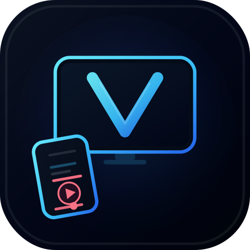
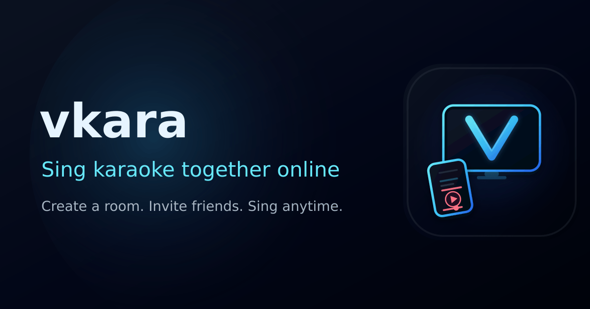

<p align="center">
  
</p>

<h1 align="center">vkara</h1>

<p align="center">
  <strong>Biến TV thành dàn karaoke trong nhà.</strong><br />
  Mở bài trên màn hình lớn, còn mọi người chọn bài bằng điện thoại.
</p>

<p align="center">
  
  
  
  
</p>

<p align="center">
  Mở vkara trên TV hoặc laptop. Bạn bè vào cùng phòng bằng điện thoại, tìm bài karaoke trên YouTube, thêm vào danh sách chờ rồi điều khiển phát nhạc cùng nhau - <strong>không cần cài app, không cần tạo tài khoản</strong>.
</p>

<p align="center">
  Hợp với karaoke gia đình, tiệc nhỏ, phòng trọ, ký túc xá, hoặc những buổi tụ tập bạn bè.
</p>

<p align="center">
  <a href="https://vkara.vercel.app/"><strong>Dùng thử → vkara.vercel.app</strong></a>
</p>

<p align="center">
  <a href="../../README.md">English</a>
  ·
  <strong>Tiếng Việt</strong>
  <!-- · <a href="../xx/README.md">Language</a> -->
</p>

<p align="center">
  <a href="#tai-sao-vkara">Tại sao vkara?</a> ·
  <a href="#cach-dung">Cách dùng</a> ·
  <a href="#tu-chay-vkara">Tự chạy vkara</a> ·
  <a href="#danh-cho-dev">Dành cho dev</a>
</p>

<p align="center">
  
</p>

<p align="center"><em>Một màn hình lớn để phát nhạc. Điện thoại dùng để tìm bài, thêm bài và điều khiển.</em></p>

---

<h2 id="tai-sao-vkara">Tại sao vkara?</h2>

- **Không phải gõ tên bài bằng remote TV** - tìm bài bằng bàn phím điện thoại nhanh hơn nhiều.
- **Ai cũng có thể thêm bài** - không cần chuyền remote qua lại.
- **Một màn hình phát chung** - TV hoặc laptop chỉ tập trung phát video.
- **Chạy ngay trên trình duyệt** - không cần cài app, không cần đăng ký.
- **Có thể tự host** - dùng Docker để chạy bản riêng của bạn.

## Cách hoạt động

1. **Mở trên TV hoặc laptop** - vkara tạo một phòng với **mã 4 số** và **mã QR**.
2. **Mọi người vào bằng điện thoại** - nhập mã phòng hoặc quét QR.
3. **Cùng chọn bài và hát** - tìm bài trên YouTube, thêm vào danh sách chờ, chuyển bài, tạm dừng. Mọi thứ được đồng bộ trong cùng một phòng.

<h2 id="cach-dung">Cách dùng</h2>

### Chủ phòng, dùng TV hoặc laptop

1. Mở [vkara](https://vkara.vercel.app/) bằng Chrome hoặc Edge trên màn hình lớn.
2. Chia sẻ **mã phòng** hoặc **mã QR** cho mọi người.
3. Bật toàn màn hình và để danh sách bài hát chạy.

### Người tham gia, dùng điện thoại

1. Mở vkara, quét QR hoặc nhập mã phòng.
2. Tìm bài, thêm vào danh sách chờ và điều khiển phát nhạc trên điện thoại.
3. Nhập mật khẩu phòng nếu chủ phòng có đặt.

### Mẹo nhỏ

| Tình huống | Cách xử lý |
|------------|------------|
| Trình duyệt trên TV yếu hoặc quá cũ | Cắm laptop vào TV qua HDMI |
| Muốn tìm bản karaoke | Bật bộ lọc karaoke khi tìm kiếm |
| Giao diện app · Tiếng Việt | Mở [`/`](https://vkara.vercel.app/) |
| Giao diện app · Tiếng Anh | Mở [`/en`](https://vkara.vercel.app/en) |

## FAQ

**Có cần tài khoản không?**  
Không. Chỉ cần mã phòng hoặc QR là vào được. Chủ phòng có thể đặt thêm mật khẩu nếu muốn.

**Bài hát lấy từ đâu?**  
vkara tìm kiếm và phát video từ YouTube. Một số video không cho nhúng vào trang khác, nên vkara có thể bỏ qua các video đó. Việc sử dụng nội dung YouTube tuân theo [Điều khoản dịch vụ của YouTube](https://www.youtube.com/t/terms).

**vkara có phải sản phẩm của YouTube không?**  
Không. vkara không thuộc YouTube và không được YouTube bảo trợ. Dự án chỉ dùng tìm kiếm và trình phát nhúng từ YouTube.

**Vì sao tách giao diện TV và điện thoại?**  
Màn hình lớn dùng để xem và nghe. Điện thoại dùng để tìm bài, thêm bài và điều khiển, đỡ phải gõ từng chữ bằng remote TV.

**Tôi có thể tự chạy vkara không?**  
Có. Xem phần [Tự chạy vkara](#tu-chay-vkara) bên dưới, hoặc đọc hướng dẫn đầy đủ tại [containers/README.md](../../containers/README.md) bằng tiếng Anh.

---

<h2 id="tu-chay-vkara">Tự chạy vkara</h2>

Cách đơn giản nhất là dùng image **all-in-one** (`vkara-aio`). Image này chạy cả web app và backend trên **cổng 3000**, với cấu hình mặc định đã chuẩn bị sẵn.

```bash
cp containers/aio/.env.example containers/aio/.env
docker compose --profile aio up --build
```

Sau đó mở:

```text
http://localhost:3000
```

Hoặc dùng image có sẵn trên Docker Hub:

```bash
docker pull lehuygiang28/vkara-aio:latest
docker run --rm -p 3000:3000 lehuygiang28/vkara-aio:latest
```

Nếu muốn tách web/API, cấu hình production, hoặc dùng các profile khác, xem thêm tại **[containers/README.md](../../containers/README.md)**.

---

<h2 id="danh-cho-dev">Dành cho dev</h2>

<details>
<summary><strong>Chạy local</strong></summary>

**Yêu cầu:** [Bun](https://bun.sh) ≥ 1.3.13, Redis, Node.js 22+ nếu cần build web production.

```bash
git clone https://github.com/lehuygiang28/vkara.git
cd vkara
bun install
```

Copy file môi trường:

- `apps/api/.env.example` → `apps/api/.env`
- `apps/web/.env.example` → `apps/web/.env.local`

Chạy Redis, ví dụ:

```bash
docker run -d --name vkara-redis -p 6379:6379 redis:7-alpine \
  redis-server --requirepass giang
```

Chạy môi trường dev:

```bash
bun run dev          # web :3000 + API :8000
bun run dev:web
bun run dev:api
```

</details>

<details>
<summary><strong>Docker images</strong></summary>

| Image | Port | Ghi chú |
|-------|------|---------|
| `lehuygiang28/vkara-aio` | 3000 | Chạy cả web và backend, khuyến nghị dùng thử trước |
| `lehuygiang28/vkara-web` | 3000 | Chỉ frontend |
| `lehuygiang28/vkara-api` | 8000 | Chỉ API, cần tự chuẩn bị Redis |
| `lehuygiang28/vkara-api-redis` | 8000 | API + Redis trong cùng container; Redis không publish ra ngoài |

Compose profiles: `aio`, `web`, `api`, `bundle`, `whisper`.

Chi tiết xem tại [containers/README.md](../../containers/README.md).

</details>

<details>
<summary><strong>Tech stack</strong></summary>

| Layer | Stack |
|-------|-------|
| Frontend | Next.js 15, React 19, Tailwind |
| Backend | Bun, Elysia |
| State | Redis |
| Repo | Bun workspaces, Turborepo |

Tìm kiếm bằng giọng nói, nếu cần: [Whisper STT](../../containers/whisper-stt/README.md).

</details>

<details>
<summary><strong>Cấu trúc repo</strong></summary>

```text
vkara/
├── apps/
│   ├── web/                 frontend
│   └── api/                 backend
├── packages/
│   └── shared-types/        shared API & realtime types
├── containers/
│   ├── aio/                 all-in-one Docker image
│   ├── api-redis/           API + Redis bundle
│   └── whisper-stt/         optional voice search
└── docker-compose.yml
```

Các type dùng chung cho API và realtime nằm trong `packages/shared-types`. Khi đổi contract giữa web và API, nên cập nhật ở đây trước.

**Scripts:** `bun run dev` · `bun run build` · `bun run format`

**Docs:** [Monorepo architecture](../monorepo-architecture.md) bằng tiếng Anh.

</details>

## Đóng góp

Issue và pull request đều được chào đón.

Nếu thay đổi contract API hoặc realtime message, hãy cập nhật `packages/shared-types` trước.

## Cảm ơn

Tính năng tìm kiếm và phát YouTube trong vkara có sử dụng các thư viện mã nguồn mở sau:

| Thư viện | Tác giả | Dùng cho |
|----------|---------|----------|
| [youtubei](https://github.com/SuspiciousLookingOwl/youtubei) | [@SuspiciousLookingOwl](https://github.com/SuspiciousLookingOwl) | Tìm kiếm, metadata, playlist, Innertube API |
| [youtube-sr](https://github.com/twlite/youtube-sr) | [@twlite](https://github.com/twlite) | Gợi ý tìm kiếm |
| [react-youtube](https://github.com/tjallingt/react-youtube) | [@tjallingt](https://github.com/tjallingt) | Nhúng YouTube player vào web app |

Cảm ơn các maintainer và contributor của những dự án này.

## License

MIT - xem [LICENSE](../../LICENSE).

---

<p align="center">
  <a href="https://github.com/lehuygiang28/vkara">github.com/lehuygiang28/vkara</a>
</p>
